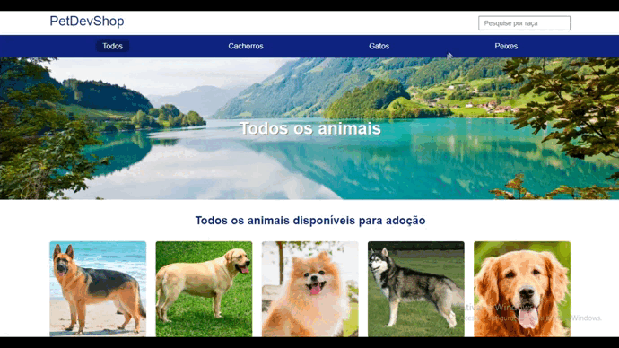

# NodeJS-PetDev

## | About

My very first project using NodeJS. On this project, I've worked on the backend.

## | Overview

## | Search Bar

## | Done with
<ul>
    <li>HTML</li>
    <li>CSS</li>
    <li>NodeJS</li>
</ul>

## | How to Run

Make sure "Git" is installed in your PC!

    git clone https://github.com/Bruno-Messias-B-S/nodejs-petDev

### Prerequisite
    npm install -g nodemon typescript ts-node

### Installation
    npm install

### To Run
    npm run start-dev

## | Made By
[Bruno Messias](https://www.linkedin.com/in/bruno-messias-bs/)
